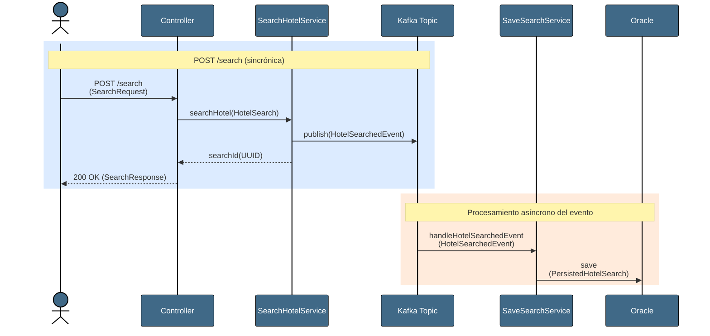
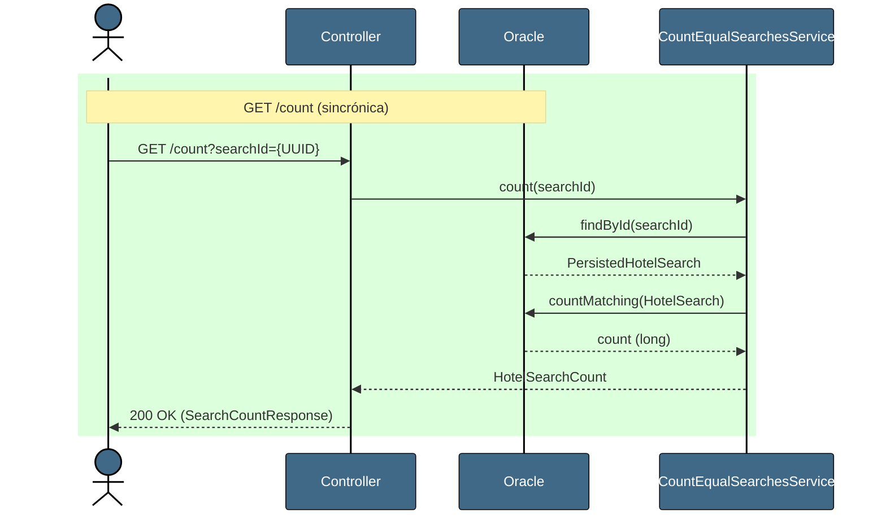
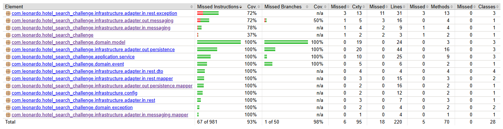
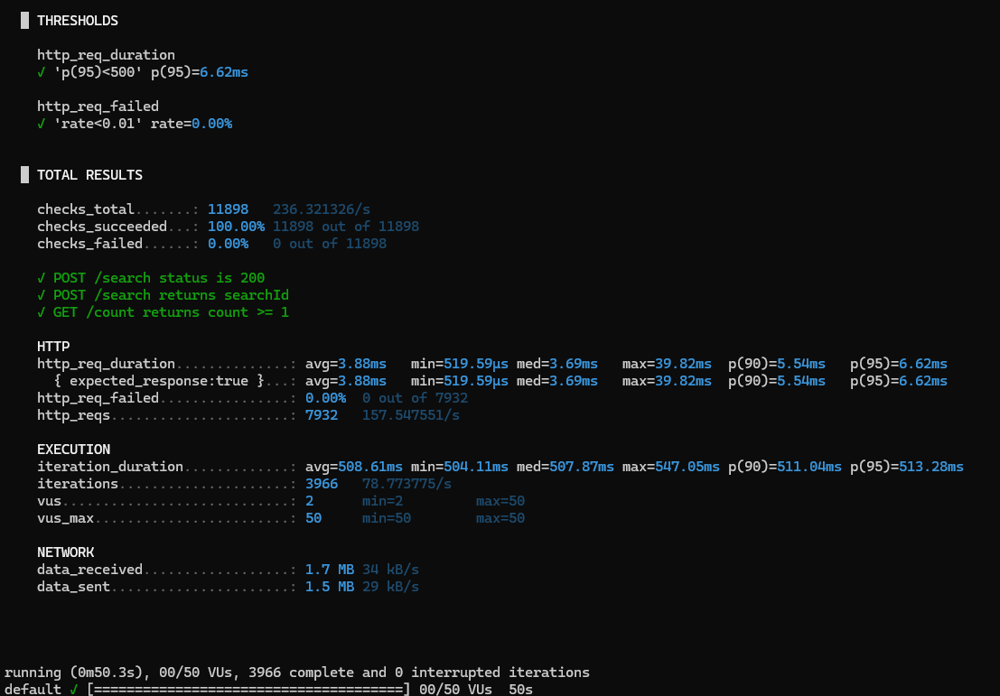

# RIU Hotels - Hotel Search Challenge


[](https://codecov.io/gh/leogil02/RIU-Backend-Leonardo-Gil)

API REST para registrar búsquedas de hoteles y consultar la cantidad de coincidencias de búsquedas.

Las búsquedas se publican como eventos a Kafka y se persisten asincrónicamente en Oracle.

---

## Desafío

### Objetivo

Desarrollar una API REST con Spring Boot que exponga dos endpoints:

- `POST /search`: recibe los criterios de búsqueda de un hotel, los publica en Kafka y devuelve un searchId único. Luego se persiste la búsqueda en una base de datos Oracle de forma asíncrona (escuchando el evento que se publica).
- `GET /count`: se envía por parámetro (llamado "searchId") y se devuelve los criterios de la búsqueda y la cantidad total de búsquedas realizadas con esos mismos criterios.

---

### Requisitos principales

- Arquitectura hexagonal estricta
- Kafka como sistema de mensajería asíncrona
- Persistencia en Oracle
- Tests con JaCoCo al 80% mínimo en branch, líneas, sentencias y métodos
- Dockerización completa
- Virtual Threads para guardado en base de datos
- Swagger para documentación
- Objetos inmutables
- Usar últimas versiones y features de las tecnologías utilizadas
- Validaciones de requests
- No permitir inyecciones SQL en request
- Peticiones thread safe


---


## Tecnologías

| Tecnología              | Versión      | Uso                                     |
|-------------------------|--------------|-----------------------------------------|
| Java                    | 25           | Lenguaje principal + Virtual Threads    |
| Spring Boot             | 4.0.6        | Framework principal                     |
| Apache Kafka            | 3.8.0        | Mensajería asincrónica (con KRaft)      |
| Oracle Free             | 23-slim      | Persistencia                            |
| Hibernate ORM           | 7.2.12.Final | ORM                                     |
| Flyway                  | 11.14.1      | Migraciones versionadas del schema      |
| Spring Data JPA         | 4.0.5        | Repositorios                            |
| Spring Boot Actuator    | 4.0.6        | Health endpoint y probes de readiness   |
| Springdoc OpenAPI       | 3.0.2        | Documentación Swagger                   |
| JUnit Jupiter           | 6.0.3        | Tests unitarios y de integración        |
| Mockito                 | 5.20.0       | Mocks en tests                          |
| Testcontainers          | 2.0.5        | Tests de integración con Oracle y Kafka |
| JaCoCo                  | -            | Cobertura de código                     |
| Grafana k6              | 2.0.0-rc1    | Tests de performance                    |
| Docker / Docker Compose | -            | Dockerización del proyecto              |


---

## Arquitectura

El sistema sigue una arquitectura hexagonal estricta.

- Domain no conoce detalles de capas superiores
- Application sólo se conoce a sí mismo y a domain
- Infrastructure conoce detalles de todas las capas

| Capa | Contenido |
|---|---|
| Domain | Records, eventos de dominio, exceptions de dominio |
| Application | Use cases y services |
| Infrastructure | Adaptador REST, Kafka producer y consumer, adaptador de persistencia JPA con Oracle |

### Diagramas de secuencia

#### POST /search



#### GET /count



---


## Prerrequisitos

- Docker instalado y corriendo.
- Puertos libres:
  - `8080` → App
  - `1521` → Oracle
  - `9092` → Kafka
  - `8090` → Kafka UI

---

## Cómo levantar

**1. Copiar las variables de entorno:**

**Esto se debe hacer dentro del directorio raíz del proyecto:**

En Linux, macOS, Git Bash, PowerShell
```bash
cp .env.example .env
```

En Windows CMD:
```bash
copy .env.example .env
```

El archivo `.env.example` ya tiene valores por defecto que funcionan sin modificación. Se pueden cambiar por los valores que se deseen pero esas variables deben tener valores obligatoriamente.

**2. Levantar todos los servicios:**

```bash
docker-compose up --build -d
```

Luego de realizar ese comando, esperar a que todos los servicios estén creados y que los servicios de `kafka` y `oracle-db` estén en estado `healthy`.

**3. Detener todos los servicios:**

```bash
docker-compose down
```

Si quiere también borrar los volúmenes de Kafka y Oracle debe ejecutar el siguiente comando:

```bash
docker-compose down -v
```

---

## Servicios


| Servicio | URL | Descripción |
|---|---|---|
| Swagger UI | http://localhost:8080/swagger-ui/index.html | Documentación interactiva de los endpoints |
| API docs (JSON) | http://localhost:8080/v3/api-docs | Especificación OpenAPI en formato JSON |
| Kafka UI | http://localhost:8090 | Interfaz visual para ver el topic "hotel_availability_searches" |

---

## Endpoints

### POST /api/v1/hotels/search

Registra una nueva búsqueda de hotel. Publica un evento a Kafka que se consume asincrónicamente para persistir la búsqueda en Oracle.

---

### GET /api/v1/hotels/count?searchId={searchId}

Se envía por parámetro un `searchId`, devuelve los criterios de esa búsqueda y la cantidad total de búsquedas registradas con los mismos criterios. 

Cabe aclarar que el orden de los ages importa. Por ejemplo, `[30, 29, 1, 3]` y `[1, 3, 29, 30]` se consideran búsquedas distintas.


---

## Tests

### Correr los tests

Ejecuta tests unitarios, test de integración con Testcontainers y genera el reporte de JaCoCo. No es necesario tener Maven ni Java descargados para ejecutar estos tests.

```bash
docker compose --profile test run --rm test
```

### Cobertura

| Métrica      | Cobertura |
|--------------|-----------|
| Instructions | 93%       |
| Branches     | 98%       |
| Lines        | 92%       |
| Methods      | 93%       |

El reporte completo se genera en `target/site/jacoco/index.html`.



---

## Performance

Tests de carga ejecutados con Grafana k6 (`k6/hotel-search-load-test.js`).

### Escenario

- 50 usuarios virtuales concurrentes.
- Ramp-up de 0 a 50 usuarios en 10 segundos.
- Carga sostenida de 50 usuarios durante 30 segundos.
- Ramp-down de 50 a 0 usuarios en 10 segundos.
- Cada iteración ejecuta el flujo completo: `POST /search` → polling `GET /count` hasta confirmar persistencia.
- Todas las iteraciones utilizan el mismo criterio de búsqueda (hardcodeado en el script: hotelId `1234aBc`, checkIn `29/12/2027`, checkOut `31/12/2027`, ages `[30, 29, 1, 3]`). Esto permite que el `GET /count` valide la persistencia del evento previo en cada iteración.

### Resultados

| Métrica               | Resultado          | Threshold |
|-----------------------|--------------------|-----------|
| p(95) response time   | 3.75ms             | < 500ms ✅ |
| Error rate            | 0.00%              | < 1% ✅    |
| Throughput            | 159 req/s          | -         |
| Checks exitosos       | 100% (11991/11991) | -         |
| Iteraciones completas | 3997               | -         |



### Correr el test de performance

No es necesario tener instalado k6 para poder ejecutar los tests de performance.

```bash
docker compose --profile perf run --rm k6
```

Al finalizar la ejecución, la tabla `hotel_searches` queda poblada con aproximadamente 4000 registros, todos con los mismos criterios de búsqueda. Por lo tanto, una llamada manual a `GET /count` con esos mismos criterios después del test devolverá un valor cercano a esa cantidad. Para limpiar la base entre ejecuciones se pueden bajar los volúmenes con `docker-compose down -v`.

---

## Decisiones de diseño

### Manejo de @Service y @Transactional en la capa de `application`

Para que la capa de `application` esté libre de dependencias del framework, los servicios no utilizan `@Service` ni `@Transactional`.

- Cada caso de uso se registra como un `@Bean` en `UseCasesBeanConfiguration` (en infrastructure)
- El manejo de transacciones se delega a decorators en `infrastructure`. Estos envuelven el service con `@Transactional`

De esta forma, la lógica de la aplicación sea testeable sin el contexto de Spring (lo cual hace mucho más rápidos los tests)

### Separación `HotelSearchedEvent` y `PersistedHotelSearch`

`HotelSearchedEvent` es el evento de dominio que viaja por Kafka, mientras que `PersistedHotelSearch` es la entidad que se persiste en Oracle.

Ambas entidades tienen los mismos datos, pero son conceptos distintos. En un futuro podrían evolucionar de forma independiente y diferir en estos datos, por lo que lo mejor sería separar estas entidades.

Esta separación desacopla el modelo de mensajería con el de persistencia.


### `AgeConverter` con serialización CSV

El requisito del endpoint de `GET /count` es comparar listas de edades **preservando el orden**: `[30, 29, 1, 3]` y `[1, 3, 29, 30]` deben contarse como búsquedas distintas.

Las opciones evaluadas fueron:

- **`@ElementCollection`** (mapeo JPA estándar): genera una tabla hija con una columna `position` para preservar el orden, pero el query del `GET /count` se vuelve complejo (JOIN + comparación posición por posición). Una variante sería reconstruir el CSV con `LISTAGG(age, ',') WITHIN GROUP (ORDER BY position)`, pero esa función es específica de Oracle, lo cual acoplaría la solución al motor.
- **CSV con `AttributeConverter`**: serializa la lista como `"30,29,1,3"` en una columna `VARCHAR2`. La comparación es trivial (`WHERE ages = :ages`) y el orden queda preservado por el formato mismo del string.

Se eligió la segunda opción por su simplicidad en el hot path del sistema. Como contrapartida, no permite queries sobre edades individuales (ej: "todas las búsquedas con al menos un menor"), lo que no es un requisito actual.

La decisión es reversible a bajo costo: la serialización está aislada en el `AttributeConverter`, por lo que migrar a una tabla hija o cualquier otra estructura implicaría cambios contenidos en el converter, la entidad y una nueva migración Flyway. El dominio (`HotelSearch.ages` sigue siendo `List<Integer>`) y los services no se enteran del cambio.

### Query nativa en `countMatching`

Spring Data JPQL no aplica `AttributeConverter` en las cláusulas `WHERE`. Al usar `countByHotelIdAndCheckInAndCheckOutAndAges(...)` con JPQL, Hibernate no serializa la lista de ages con el converter antes de comparar. La solución es usar `nativeQuery = true` para que la query llegue directamente a Oracle con el string ya serializado.

### Tests de integración con Testcontainers

Los tests IT usan Testcontainers para levantar Oracle y Kafka reales en Docker. La limpieza entre tests se hace con `TRUNCATE TABLE` via `JdbcTemplate` (más rápido y determinístico que `deleteAll()`). Awaitility maneja la asincronía de Kafka (evitando de esta forma `Thread.sleep`).

### Dockerfile multi-stage (4 etapas)

| Stage | Funcionalidad | Descripción |
|---|---|---|
| 1 | Dependencias | Descarga y cachea las dependencias de Maven |
| 2 | Builder | Compila el código fuente para la imagen de runtime |
| 3 | Runtime | Imagen final sólo con JRE, usada por el servicio `app` |
| 4 | Test | Ejecuta `verify` completo (unitarios + integración + JaCoCo), usado por el servicio `test` |

De esta forma, se aprovecha el caché de Docker. Si sólo se cambia código fuente (y no se modifica el pom.xml), Docker reusa la capa de dependencias y el build es mucha más rápido.

### Manejo de fallos en consumer con retry y DLT

En `HotelSearchedEventConsumer` se utiliza `@RetryableTopic` para reintentar el procesamiento de eventos fallidos. Este está configurado de la siguiente manera:

- 5 reintentos máximo
- Backoff exponencial: empieza en 1 segundo y se multiplica por 1.5 por cada intento que pasa
- Al agotar los reintentos, el evento se envía al DLT `hotel_availability_searches.dlt`
- Se utiliza `@DltHandler` para dejar registro del evento descartado (a través de logs) y que se pueda revisar y reprocesar de forma manual

Esto garantiza que un fallo transitorio no descarte un evento, y que un fallo persistente no bloquee el procesamiento del topic.

### Idempotencia en consumer

Se realizó un chequeo previo a la persistencia de la búsqueda en `SaveSearchService` a través de `existsById`. De esta forma, si ya existe una búsqueda con el `searchId` que se quiere persistir, se ignora el evento y se loguea para ver la trazabilidad.

Como última defensa, `searchId` es primary key, por lo que Oracle rechazaría cualquier insert duplicado.

Esta combinación hace que, al intentar reprocesar un mismo evento N veces, el resultado siempre sea el mismo, sin generar errores que terminen en la DLT por una causa que realmente no es un fallo.

### Gestión del schema con Flyway

El schema de la base de datos se gestiona con Flyway en lugar de delegarlo a Hibernate con `ddl-auto: update`. La configuración de Hibernate se cambia a `ddl-auto: validate`, para que verifique al arrancar que el schema coincide con las entidades JPA.

Las razones principales de este cambio son:

- **Control total sobre la base de datos:** los scripts se escriben manualmente y no los decide Hibernate en runtime
- **Versionado de base de datos:** cada modificación del esquema queda registrado en la tabla `flyway_schema_history`
- **Cobertura completa de cambios:** `ddl-auto: update` sólo agrega tablas y columnas nuevas, pero no se encarga de borrar columnas viejas, no las renombra, no cambia tipos y tampoco borra constraints. Esto puede dejar el schema en estados inconsistentes.

Las migraciones se encuentran en `src/main/resources/db/migration/` y usan timestamps en sus nombres (`V{yyyyMMdd_HHmmss}__descripcion.sql`) en lugar de una numeración incremental (para evitar problemas cuando hay varias personas trabajando sobre esta base de datos en paralelo).

### Índice compuesto en la tabla `hotel_searches`

La query de `countMatching` que utiliza `GET /count` para contar la cantidad de coincidencias exactas de búsqueda filtra por `hotel_id`, `check_in`, `check_out` y `ages`.

Sin un índice apropiado, la base de datos haría un escaneo completo de la tabla para buscar las coincidencias, lo que daría como resultado tiempos de espera cada vez más altos conforme la cantidad de registros crezca.

Para evitar esto, se creó un índice compuesto sobre las cuatro columnas utilizadas para esa búsqueda.

El overhead del índice en los `INSERT` es despreciable (microsegundos), mientras que la mejora en la lectura es muy alta.

El impacto fue medido: en los tests de carga con k6, el `p(95)` bajó de 6.62 ms a 3.75 ms (un 43% de mejora). La diferencia de latencia crece conforme la tabla crece en registros.